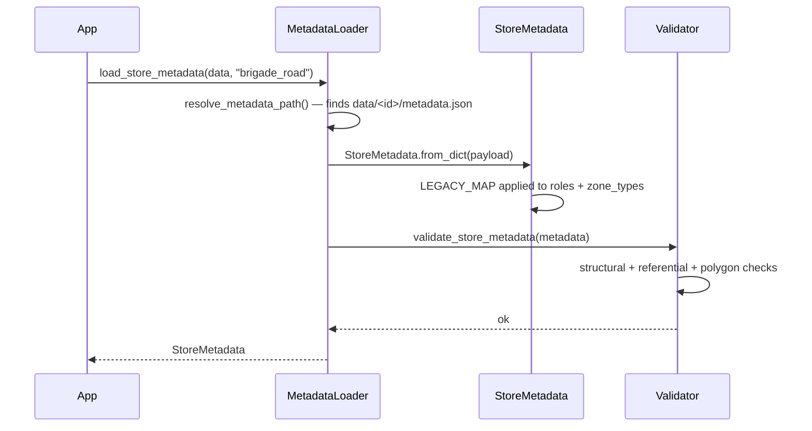
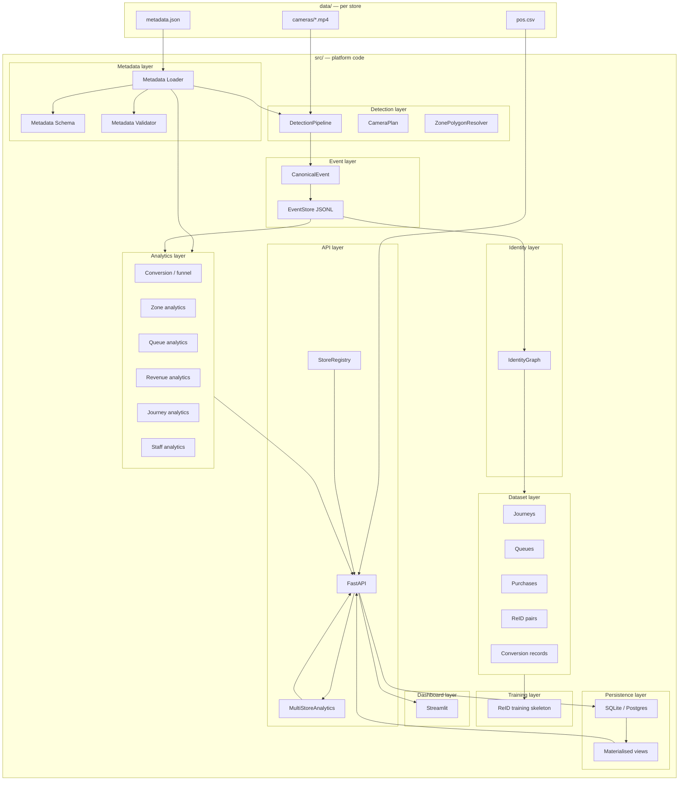
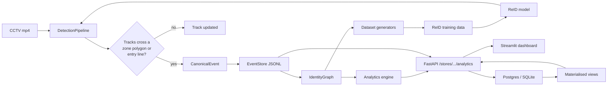
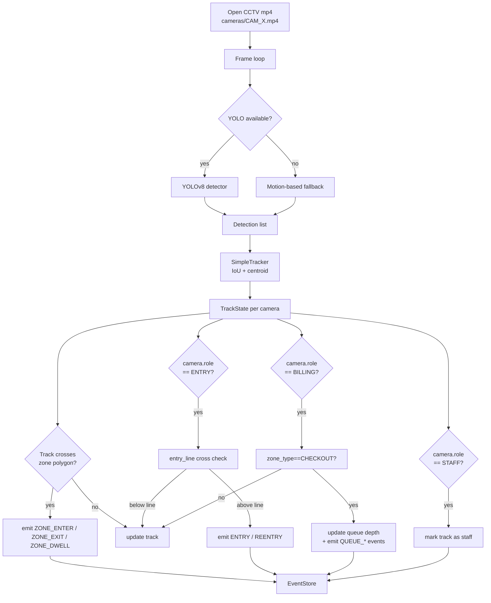
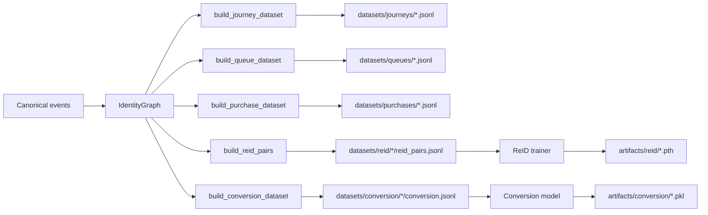
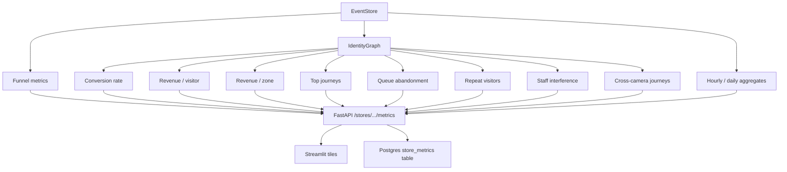
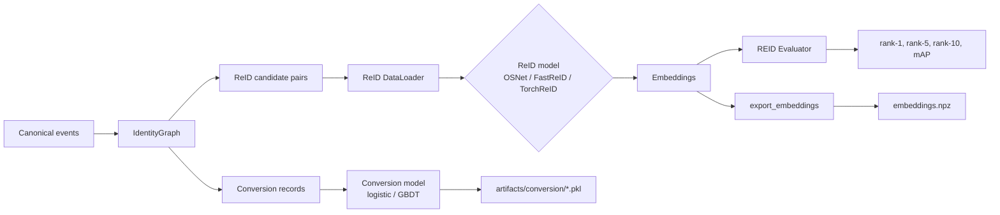
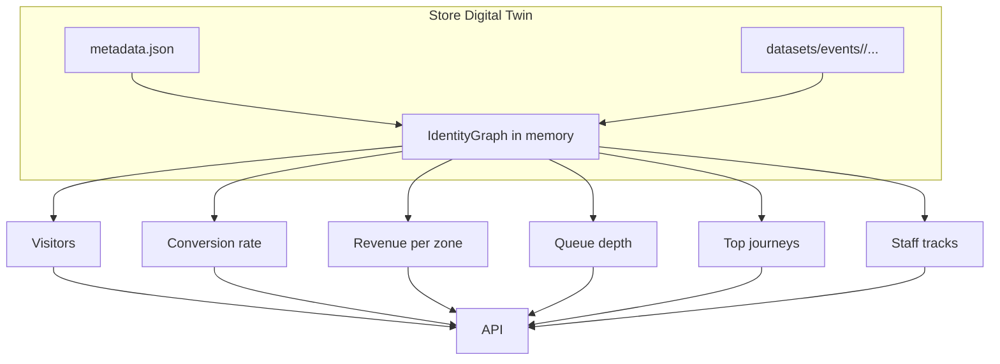
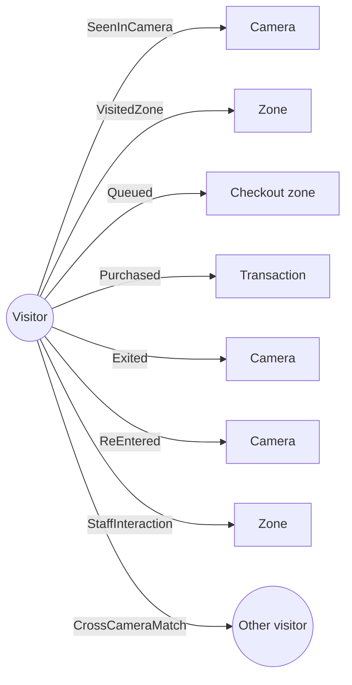
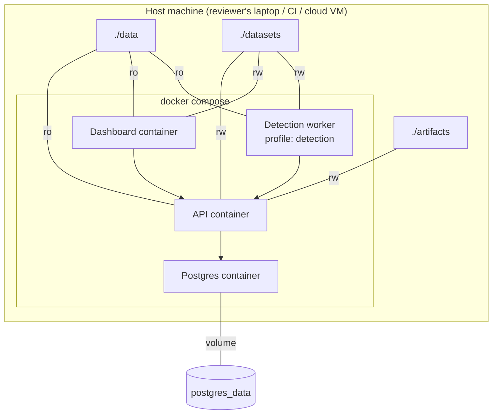

# Architecture

> VisionRetail AI — Purplle Tech Challenge 2026

This document is the architectural source of truth.  It explains the
data model, the runtime flow, and the metadata-driven boundaries
that make the platform multi-store-ready.

For the practical "how do I run it" walkthrough see
[QUICKSTART.md](QUICKSTART.md).  For onboarding a new store see
[MULTI_STORE_GUIDE.md](MULTI_STORE_GUIDE.md).

---

## 1. The non-negotiable: metadata is the source of truth

There is exactly one place where store-specific facts live:
`data/<store_id>/metadata.json`.  Every other module — the detection
pipeline, the analytics engine, the API, the dashboard, the dataset
generators, the ReID training pipeline — reads from this file and
from the canonical event stream it produces.  Nothing else.

### 1.1 What the metadata contains

```text
metadata.json
├── schema_version      1.0.0
├── store               identity (id, name, city, country, timezone, aliases)
├── layout              width × height in normalized units + image
├── zones[]             one entry per zone with normalized polygon
│   ├── zone_id
│   ├── zone_name
│   ├── zone_type       ENTRY | EXIT | AISLE | DISPLAY | BRAND |
│   │                   CHECKOUT | QUEUE | STAFF
│   ├── polygon         list of [x, y] in [0, 1]
│   ├── layout_box      optional [x1, y1, x2, y2] in original units
│   └── brands          list of brand codes anchored to the zone
├── cameras[]           one entry per camera
│   ├── camera_id
│   ├── role            ENTRY | EXIT | ZONE | BILLING | QUEUE | STAFF
│   ├── source_file     path under cameras/
│   ├── coverage[]      list of zone_ids
│   ├── zone_polygons   per-zone override polygons (optional)
│   ├── entry_line      { y_normalized, exterior_side } (optional)
│   └── adjacent_cameras[]  list of neighbour camera_ids
└── transition_graph    adjacency map: camera_id -> [camera_id, ...]
```

The `LEGACY_MAP` in `src/metadata/schema.py` normalises legacy
aliases (`FLOOR` → `ZONE`, `SUPPORT` → `STAFF`, `BILLING` →
`CHECKOUT`, `MAKEUP` → `BRAND`, etc.) so older metadata files keep
working without code changes.

### 1.2 How metadata is loaded



On failure the loader raises `MetadataLoadError` with a list of
human-readable problems.  The whole stack fails fast — no half-loaded
stores.

---

## 2. System architecture



---

## 3. Data flow

The full lifecycle of one event, from CCTV pixel to dashboard tile.



---

## 4. Detection pipeline

The detection pipeline is fully metadata-driven.  It does not know
what store it is running against, what cameras exist, or what zone a
detection belongs to — every decision is made by looking up
`StoreMetadata` at runtime.



**Key design choices:**

1. **The pipeline holds no state across cameras** — every track is
   `per-camera-local`.  Cross-camera ReID is handled by the matching
   service that runs on top of the canonical event stream, not inside
   the pipeline.

2. **Zone polygons are normalised to [0, 1]** in the metadata.  The
   pipeline projects them onto the actual frame size at runtime, so
   the same metadata works for 1920×1080, 640×480, or any other
   resolution.

3. **The motion-based fallback** means the pipeline is useful on
   machines without a GPU.  It tracks connected components in the
   frame-difference image and runs the same zone / entry / exit
   logic.  This is what makes the demo runnable on a laptop.

---

## 5. Journey pipeline

After the event store is populated, the journey engine reads events
and constructs per-visitor journeys.



---

## 6. Analytics pipeline

Analytics is *derived* from the event store and the identity graph.
There is no separate analytics database — every answer comes from
re-reading the canonical events.



The **north-star metric** (`Conversion Rate`) is computed in
`IdentityGraph.conversion_rate()` and surfaces on every analytics
endpoint, every dashboard tile, and every cross-store summary.

---

## 7. Training pipeline

The training pipeline is intentionally a skeleton.  It builds all
the surrounding infrastructure (datasets, model registry, evaluator,
embedding exporter) and triggers the actual training loop only when
PyTorch is available.



---

## 8. Store digital twin

The "digital twin" is the metadata plus the events that have been
collected against it.  Every analytics query is effectively
"ask the digital twin".



The `MultiStoreAnalytics` orchestrator (in `src/multi_store/`) is the
single surface that hosts every digital-twin query.  Both the API
and the dashboard go through it.

---

## 9. Customer identity graph

The identity graph is a directed graph of `Visitor` nodes and the
edges that connect them to zones, cameras, purchases, queues, and
other visitors.



Edges are timestamped and carry metadata.  The graph is a
**side-effect of the event stream** — it is not a separate database.
That means losing the graph is non-destructive: rebuilding it from
`EventStore` is O(events) and takes seconds.

---

## 10. Deployment architecture



The detection worker is a separate compose profile — by default only
the API and dashboard come up.  Reviewers who want to run the
detection pipeline invoke `docker compose --profile detection up`.

---

## 11. Failure modes and guarantees

| Failure | Detection | Recovery |
| --- | --- | --- |
| `metadata.json` missing | `MetadataLoadError` at load time | `python3 scripts/validate_metadata.py` |
| `metadata.json` has unknown role | `MetadataLoadError` (strict) or `LEGACY_MAP` (default) | Add the role to the canonical enum |
| Zone polygon malformed | Validator flags it | Edit metadata, re-validate |
| Camera source file missing | Validator flags it | Drop the file, re-validate |
| Camera transition invalid | Pipeline rejects the cross-camera match | Add the edge to `transition_graph` |
| Event has unknown type | Validator falls back to `ZONE_ENTER` | Add the type to `CanonicalEventType` |
| POS row has no visitor | Conversion model skips the row | Impute from nearest ENTRY timestamp (future) |
| Test fails on CI | pytest reports the failure | The tests are independent — fix the unit, not the suite |

The platform is designed so **no failure mode causes silent data
loss**.  Every error path either raises an exception (with a
descriptive message), writes a structured log entry, or appears in
the validation report.

---

## 12. Extension points

The platform has exactly three extension points, all metadata-driven:

1. **Add a new store.**  Drop `metadata.json` + `cameras/` + `pos.csv`
   under `data/<store>/`.  No code changes.
2. **Add a new event type.**  Add a member to `CanonicalEventType`
   and handle it in `IdentityGraph.add_event` and the dataset
   generators.  Old event types keep working.
3. **Add a new model.**  Subclass `ReIDModel` in `src/reid/`, register
   it in `MODEL_REGISTRY`.  Old models keep working.

Everything else is downstream of these three.
